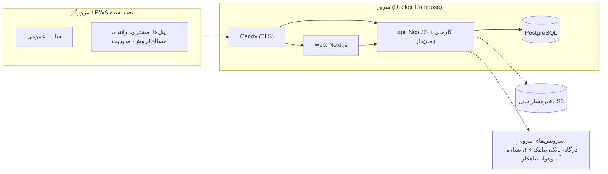
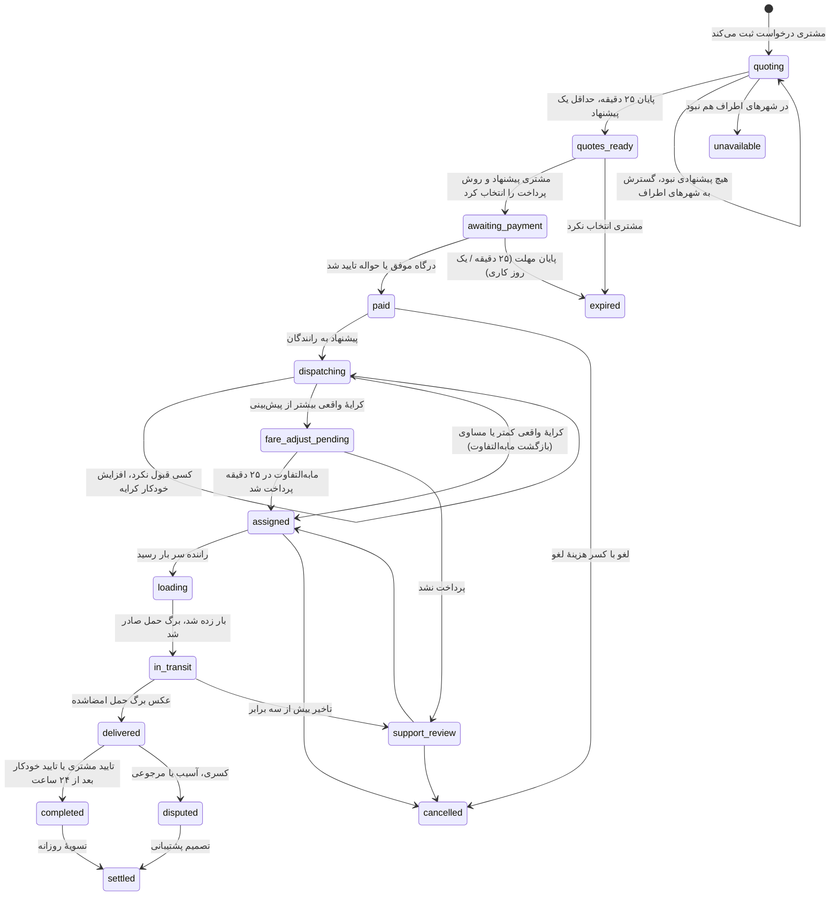
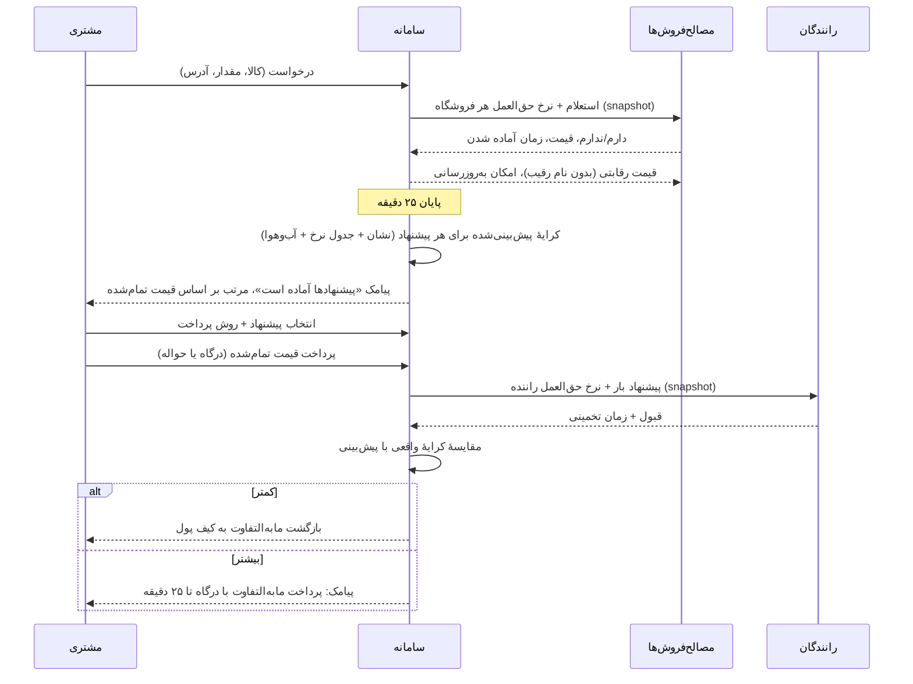
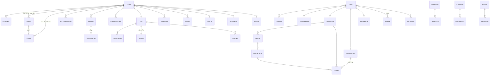

# طراحی فنی سامانهٔ «های مصالح»

> **مبنا:** `docs/system-processes.docx` (سند فرایندهای تاییدشده). هر بخش این سند به فصل متناظر آن ارجاع می‌دهد، مثلاً «(فرایند ۲)».
> **وضعیت:** تاییدشده. دلیل تصمیم‌ها در [`DECISIONS.md`](DECISIONS.md) و وضعیت ساخت در [`STATUS.md`](STATUS.md).

---

## ۰. اصول طراحی

1. **سادگی.** هر قطعه باید دلیل مشخصی برای بودن داشته باشد. روی سرور فقط چهار سرویس اجرا می‌شود.
2. **همهٔ عددها تنظیم‌پذیرند.** مهلت‌ها، درصدها، سقف‌ها و جریمه‌ها در جدول `settings` نگه داشته می‌شوند و مدیر در پنل تغییرشان می‌دهد. در کد هیچ عدد کسب‌وکاری ثابت نوشته نمی‌شود.
3. **پول عدد صحیح ریال است** (`BIGINT`)؛ تومان فقط در نمایش. درصدها به basis point ذخیره می‌شوند (۱۵۰ یعنی ۱٫۵٪).
4. **هر ریال در دفتر کل دوطرفه ثبت می‌شود.** موجودی هیچ کیف پولی ستون قابل‌ویرایش نیست.
5. **چیزی که به کسی نشان داده شده، همان اجرا می‌شود.** نرخ حق‌العمل، قیمت تایید‌شدهٔ مصالح‌فروش و کرایهٔ پیش‌بینی‌شده در همان لحظهٔ نمایش روی رکورد ثبت (snapshot) می‌شوند.
6. **سرور تصمیم می‌گیرد.** دسترسی، مهلت‌ها و قواعد مالی سمت سرور اعمال می‌شوند. فرانت فقط نمایش می‌دهد.

---

## ۱. نمای کلی



| سرویس | فناوری | نقش |
|---|---|---|
| `proxy` | Caddy | TLS خودکار (Let's Encrypt)، مسیردهی `/api` به `api` و بقیه به `web` |
| `web` | Next.js 15 (App Router) + Serwist | سایت عمومی (SSR/ISR برای سئو)، پنل‌ها، PWA |
| `api` | NestJS + Prisma + pg-boss | REST API، قواعد کسب‌وکار، کارهای زمان‌دار، اتصال به سرویس‌های بیرونی |
| `postgres` | PostgreSQL 16 | داده + صف کارها (pg-boss) |
| (اختیاری) `s3` | SeaweedFS | فقط اگر ذخیره‌ساز S3 جدا ندارید. MinIO دیگر ایمیج Docker عمومی منتشر نمی‌کند. |

---

## ۲. ساختار مخزن

```
/
├─ apps/
│  ├─ web/        Next.js: صفحات، پنل‌ها، کامپوننت‌ها
│  └─ api/        NestJS: ماژول‌ها، کارهای زمان‌دار، آداپتورهای سرویس بیرونی
├─ packages/
│  └─ shared/     طرح‌های zod، enumها، محاسبهٔ حق‌العمل و کرایه، فرمت عدد و پول فارسی
├─ infra/         docker-compose، Caddyfile، اسکریپت پشتیبان‌گیری
├─ design/        خروجی Claude Design (فقط مرجع)
└─ docs/          همین سند و سند فرایندها
```

ابزارها: pnpm workspaces، TypeScript strict، Vitest، Playwright (مسیرهای اصلی)، GitHub Actions.

`packages/shared` مهم‌ترین پکیج است. محاسبهٔ حق‌العمل، قیمت تمام‌شده و کرایه یک بار نوشته می‌شود و هم سرور و هم پنل‌ها از همان کد استفاده می‌کنند. عددی که مصالح‌فروش یا راننده در پنل می‌بیند، با عددی که کسر می‌شود یکی است.

---

## ۳. فرانت‌اند (`apps/web`)

### ۳.۱ مسیرها

| بخش | مسیر | رندر | فرایند |
|---|---|---|---|
| سایت عمومی | `/`، `/products`، `/products/[cat]/[sub]`، `/categories`، `/about`، `/contact` | SSG + ISR (بازسازی بعد از «انتشار» در CMS) | ۸ |
| ورود و ثبت‌نام | `/login?role=&ref=` | CSR | ۱ |
| ثبت‌نام راننده | `/driver/register` | CSR، ذخیرهٔ هر مرحله در سرور | ۱ |
| ضبط ویدیو مالک | `/owner/[token]` (لینک پیامکی) | CSR | ۱ |
| پنل مشتری | `/account`: سفارش‌ها، **پیشنهادها و پرداخت**، پروژه‌ها/آدرس‌ها، کیف پول | CSR | ۲، ۳ |
| پنل راننده | `/driver`: بار من، بار جدید، پول من، کمک | CSR | ۲، ۳ |
| پنل مصالح‌فروش | `/supplier`: درخواست، بار زدن، پول من، فروشگاه | CSR | ۱، ۲، ۳ |
| پنل مدیریت | `/admin/...` (فهرست بخش ۳.۲) | CSR | همه |

- **تغییر نقش:** کاربری که چند نقش دارد، در بالای همهٔ پنل‌ها یک دکمهٔ ثابت و ساده برای جابه‌جایی نقش می‌بیند (فرایند ۱).
- **نشانی تمیز:** نشانی‌های `.dc.html` طراحی به مسیرهای بالا تبدیل می‌شوند.

### ۳.۲ بخش‌های پنل مدیریت

بخش‌هایی که در طراحی Claude Design بودند، به‌علاوهٔ بخش‌هایی که فرایندهای تاییدشده لازم کرده‌اند (با ★):

| بخش | محتوا |
|---|---|
| داشبورد | آمار کلی، هشدارها |
| سفارش‌ها و تخصیص | سفارش‌ها، استعلام‌ها، تخصیص مستقیم راننده، **★ صف «بررسی پشتیبانی»** |
| رانندگان | بررسی مدارک، **★ هشدار انصراف‌های مکرر** |
| مصالح‌فروشان | **★ ثبت فروشگاه توسط ادمین**، بررسی جواز کسب |
| ★ تایید حواله‌ها | تطبیق رسید حواله با گردش حساب |
| مالی و حق‌العمل | نرخ‌های پیش‌فرض، تسویه‌ها، **★ واریزها (دستی، فایل گروهی، API بانک)**، برداشت‌ها |
| ★ کرایه | جدول نرخ پایه برای هر نوع خودرو، ضریب آب‌وهوا، قاعدهٔ افزایش خودکار |
| ★ قواعد | جدول هزینهٔ لغو، قاعدهٔ مرجوعی هر دسته، جریمهٔ تاخیر، آستانهٔ تماس کارشناس |
| پاداش و کمپین | چهار نوع کمپین (همراه نرخ ترجیحی) |
| معرفی | تنظیمات، رویداد واریز (سفر N‌ام)، معرفی‌های مشکوک |
| انبار خودمان | موجودی، رزروها |
| کارکنان و دسترسی | نقش‌ها، ماتریس ۱۴×۴، دسترسی سفارشی، گزارش فعالیت |
| محتوای سایت | محصولات، دسته‌ها، صفحات، تنظیمات عمومی، **★ موضوع‌های مشاوره** |
| ★ درخواست‌های مشاوره | فهرست، مهلت ۲۴ ساعته، گزارش تاخیر کارشناسان |
| ★ تنظیمات سیستم | سرویس‌های پیامک (اصلی و پشتیبان)، تقویم روزهای تعطیل، همهٔ مهلت‌ها |

### ۳.۳ طراحی بصری
- **Tailwind CSS v4** با توکن‌های استخراج‌شده از طراحی: `--orange:#FF5B0F`، `--ink:#141414`، `--bg:#F4F4F5` و چهار tone (نارنجی، سبز، آبی، طوسی).
- `dir="rtl"`، `lang="fa"` و استفاده از logical properties.
- فونت Vazirmatn و آیکون‌ها (`@tabler/icons-react`) روی سرور خودمان. CDNهای خارجی در ایران قابل اتکا نیستند.
- انیمیشن‌ها با CSS، با رعایت `prefers-reduced-motion`.
- پنل راننده و مصالح‌فروش: یک‌ستونه، دکمه‌های بزرگ، رنگ ثابت (سبز = بله، قرمز = نه)، پول به حروف («۷ میلیون و ۸۲۰ هزار تومان»)، و فایل صوتی ضبط‌شده برای «گوش بده».

### ۳.۴ داده، فرم و به‌روزرسانی
- TanStack Query برای داده. نوع‌ها از طرح‌های zod در `packages/shared` می‌آیند.
- react-hook-form + zod برای فرم‌ها، مثل اعتبارسنجی کد ملی، موبایل، پلاک و شبا.
- **بدون WebSocket.** پنل‌ها داده را هر ۲۰ ثانیه دوباره می‌گیرند، فقط وقتی صفحه باز و در دید است. رویدادهای مهم (استعلام جدید، پیشنهادها آماده، بار جدید، مابه‌التفاوت کرایه) با پیامک هم اطلاع داده می‌شوند.
- **شمارش معکوس‌ها** (۲۵ دقیقهٔ استعلام، ۲۵ دقیقهٔ درگاه، مهلت پیشنهاد بار) از روی `expiresAt` سرور در خود گوشی حساب می‌شوند.

### ۳.۵ پر شدن خودکار کد تایید
- اندروید (WebOTP API): خط آخر پیامک باید `@<دامنه> #<کد>` باشد.
- آیفون: `autocomplete="one-time-code"` روی فیلد. کد باید در متن پیامک واضح باشد.
- باید بررسی شود که قالب پیامک (pattern) سرویس پیامک این خط آخر را اجازه می‌دهد.

### ۳.۶ PWA و کار آفلاین راننده (فرایند ۲)
- Serwist برای ساخت service worker و manifest. فهرست کش خودکار ساخته می‌شود.
- کش: فونت، تصویر و JS با cache-first؛ صفحه‌ها و API با network-first؛ یک صفحهٔ «آفلاین هستید».
- **پنل راننده بدون اینترنت:**
  - هر دکمهٔ سفر فوراً در UI اعمال می‌شود و زمان و موقعیت GPS در IndexedDB ذخیره می‌شود.
  - با رویداد `online` یا باز شدن دوبارهٔ پنل، **یک درخواست** با آخرین وضعیت و زمان قدم‌های قبلی فرستاده می‌شود:
    `PATCH /trips/:id/progress { step, events: [{ step, at, lat, lng }], clientSeq }`
  - عکس‌ها (محموله در بارگیری، برگ حمل امضاشده) قبل از ذخیره در گوشی به حدود ۳۰۰ کیلوبایت فشرده و جدا آپلود می‌شوند.
  - سرور برای قدم‌های میانی پیامک نمی‌فرستد. اگر سفر در این فاصله لغو یا جابه‌جا شده باشد، درخواست را نمی‌پذیرد (`409`).

### ۳.۷ نقشه (فرایند ۱)
- `MapPicker` با Leaflet و یک آداپتور ارائه‌دهنده: **نشان** به‌عنوان اصلی، **OpenStreetMap** به‌عنوان جایگزین.
- اگر کاشی‌ها یا جستجوی نشان خطا بدهند، آداپتور خودکار به OSM می‌رود. رابط کاربری تغییری نمی‌کند.
- مسیریابی (محاسبهٔ مسافت برای کرایه) فقط سمت سرور انجام می‌شود (بخش ۴.۵).

---

## ۴. بک‌اند (`apps/api`)

### ۴.۱ فناوری
NestJS، Prisma، PostgreSQL 16، **pg-boss** (صف و زمان‌بندی داخل PostgreSQL)، pino (لاگ)، `@nestjs/throttler` با ذخیره در PostgreSQL.

### ۴.۲ ماژول‌ها

| ماژول | مسئولیت | فرایند |
|---|---|---|
| `auth` | OTP، JWT دسترسی (۱۵ دقیقه) + refresh در کوکی httpOnly، محدودیت شماره/IP/دستگاه، تشخیص ربات | ۱ |
| `users` | حساب، نقش‌ها، تغییر نقش | ۱ |
| `kyc` | مدارک، ویدیوها، متن خوانده‌شده (snapshot)، استعلام شاهکار، لینک ضبط مالک، یادآوری ۲۴ ساعته، بررسی کارشناس | ۱ |
| `drivers` | پروفایل، خودرو، مالک، شهرهای سرویس، «سر کارم»، شمارش انصراف | ۱، ۲ |
| `suppliers` | فروشگاه، مکان، دسته‌ها، جواز کسب، شبا + استعلام تطابق شبا و کد ملی، ثبت توسط ادمین | ۱ |
| `customers` | پروفایل شخصی/پیمانکار، پروژه‌ها، آدرس‌ها | ۲ |
| `catalog` / `cms` | محصولات، دسته‌ها، صفحات، تنظیمات سایت، بازسازی ISR | ۸ |
| `orders` | سفارش و ماشین حالت آن (بخش ۴.۳) | ۲ |
| `sourcing` | استعلام ۲۵ دقیقه‌ای، پاسخ‌ها، اعلام قیمت رقابتی، گسترش به شهرهای اطراف، پیشنهاد انبار خودمان | ۲، ۶ |
| `fare` | جدول نرخ پایه، مسافت از نشان، ضریب آب‌وهوا، کرایهٔ پیش‌بینی‌شده، افزایش خودکار | ۲ |
| `checkout` | انتخاب پیشنهاد، درگاه (۲۵ دقیقه)، حواله (یک روز کاری)، تطبیق رسید، مابه‌التفاوت کرایه | ۲ |
| `dispatch` | پیشنهاد بار، زمان تخمینی راننده، تخصیص مستقیم، قاعدهٔ انصراف | ۲ |
| `trips` | قدم‌های سفر، عکس‌ها، برگ حمل، تحویل، تایید خودکار ۲۴ ساعته | ۲ |
| `disputes` | اختلاف، مرجوعی (طبق قاعدهٔ هر دسته)، لغو و هزینهٔ آن | ۲ |
| `penalties` | تاخیر نسبت به زمان اعلامی: ۲۵٪ ← جریمهٔ ۱۰٪، سه برابر ← بررسی پشتیبانی | ۹ |
| `finance` | دفتر کل، نرخ‌های حق‌العمل، تسویهٔ روزانه، کیف پول، برداشت، واریز (دستی، فایل گروهی، API بانک) | ۳ |
| `invoicing` | فاکتور: فروش مستقیم (انبار خودمان) یا واسطه (کالای دیگران) | ۳ |
| `campaigns` | پاداش، کش‌بک، طرح تشویقی، نرخ ترجیحی | ۴ |
| `referral` | کد، پله‌ها، جشنواره، رویداد واریز (سفر N‌ام)، نشانه‌های تقلب | ۵ |
| `inventory` | انبارها، موجودی، رزرو تا پایان مهلت پرداخت | ۶ |
| `staff` | نقش‌ها، ماتریس دسترسی، دسترسی سفارشی، محدودهٔ شهر | ۷ |
| `consult` | درخواست مشاوره، مهلت ۲۴ ساعته، گزارش تاخیر کارشناس | ۸ |
| `geo` | جستجو و تبدیل مختصات به آدرس برای MapPicker (Nominatim با کش و محدودیت یک درخواست در ثانیه؛ نشان بعداً) | ۱ |
| `notifications` | پیامک (اصلی + پشتیبان با جابه‌جایی خودکار)، قالب‌ها، اعلان داخل پنل | ۹ |
| `files` | آپلود از طریق API (stream به S3)، بررسی نوع و حجم، لینک موقت برای دیدن | همه |
| `settings` | همهٔ پارامترهای تنظیم‌پذیر (بخش ۶) و تقویم روزهای تعطیل | همه |
| `audit` | گزارش فعالیت کارکنان، مقدار قبل و بعد برای عمل‌های حساس | ۷ |

### ۴.۳ ماشین حالت سفارش



- هر انتقال حالت در جدول `order_events` ثبت می‌شود: چه کسی، چه وقت، از کدام حالت به کدام حالت.
- انتقال‌ها فقط از یک تابع مرکزی (`OrderStateMachine.transition`) انجام می‌شوند و انتقال غیرمجاز خطا می‌دهد.
- قاعدهٔ «بارگیری فقط بعد از تسویهٔ کامل» در این ماشین حالت تضمین می‌شود: بدون عبور از `paid` و (در صورت نیاز) `fare_adjust_pending`، حالت `loading` قابل دسترسی نیست.

### ۴.۴ مسیر قیمت: از استعلام تا پرداخت



- **قیمت تمام‌شده** = بهای کالا (قیمت واحد × مقدار) + کرایهٔ پیش‌بینی‌شده (+ کارمزد مشتری اگر فعال باشد). محاسبه در `packages/shared` است.
- **اعتبار قیمت:** پیشنهاد مصالح‌فروش تا پایان مهلت روش پرداخت انتخاب‌شده معتبر است. مصالح‌فروش هنگام پاسخ، هر دو مهلت (۲۵ دقیقه و یک روز کاری) را می‌بیند.
- **هویت فروشنده** (نام و تماس) در API پیشنهادها برای مشتری تا قبل از `paid` اصلاً ارسال نمی‌شود، نه اینکه فقط در UI پنهان شود. فقط شمارهٔ ترتیبی، فاصله، قیمت کالا و کرایه برمی‌گردد.

### ۴.۵ محاسبهٔ کرایه (فرایند ۲)

```
کرایهٔ پیش‌بینی‌شده = (نرخ کیلومتر × مسافت + نرخ تن × وزن + بارگیری و تخلیه) × (۱ + ضریب برگشت خالی) × ضریب آب‌وهوا
```

- **نوع خودرو** از روی وزن و نوع بارگیر انتخاب می‌شود: کوچک‌ترین خودرویی که ظرفیتش کافی است.
- **مسافت** از API مسیریابی نشان (مسیر واقعی جاده‌ای، نه خط مستقیم) گرفته و برای هر جفت مبدا و مقصد چند ساعت کش می‌شود. اگر نشان در دسترس نبود، مسافت خط مستقیم × ضریب جاده (پیش‌فرض ۱٫۳) استفاده می‌شود و کارشناس هشدار می‌گیرد.
- **ضریب آب‌وهوا** از سرویس آب‌وهوا برای مسیر و روز بارگیری گرفته می‌شود. جدول ضرایب (برف، باران شدید، ...) در پنل تنظیم می‌شود.
- **افزایش خودکار:** اگر در `fare.autoRaiseAfterMin` دقیقه هیچ راننده‌ای قبول نکند، کرایهٔ پیشنهادی به اندازهٔ `fare.autoRaisePct` بالا می‌رود، تا سقف `fare.autoRaiseCapPct`، و کارشناس هشدار می‌گیرد.

### ۴.۶ قواعد زمان‌دار (pg-boss)

| کار | زمان پیش‌فرض | نتیجه |
|---|---|---|
| بستن استعلام | ۲۵ دقیقه بعد از ارسال | `quotes_ready` یا گسترش به شهرهای اطراف |
| مهلت پرداخت درگاه | ۲۵ دقیقه بعد از انتخاب | `expired` + آزاد شدن رزرو |
| مهلت حواله | پایان **یک روز کاری** بعد (با تقویم تعطیلات) | `expired` + آزاد شدن رزرو |
| افزایش خودکار کرایه | هر X دقیقه بدون قبول | پیشنهاد دوباره با کرایهٔ بالاتر |
| مهلت مابه‌التفاوت کرایه | ۲۵ دقیقه بعد از قبول راننده | `support_review` |
| تایید خودکار تحویل | ۲۴ ساعت بعد از `delivered` | `completed` |
| یادآوری ویدیو مالک | ۲۴ ساعت بعد از ارسال لینک | پیامک دوباره |
| بررسی تاخیر | مقایسه با زمان اعلامی مصالح‌فروش و راننده | جریمهٔ ۱۰٪ یا `support_review` |
| تسویهٔ روزانه | هر روز کاری | واریز سهم مصالح‌فروش‌ها |
| اجرای کمپین‌ها | پایان دورهٔ هر طرح | واریز جایزه |
| پاداش معرفی | با هر سفر یا سفارش موفق، بررسی رسیدن به N‌امین | واریز پاداش |
| مهلت مشاوره | ۲۴ ساعت | ثبت در گزارش تاخیر کارشناس |
| پشتیبان‌گیری | هر شب | `pg_dump` به S3 |

**یک روز کاری** از روی جدول `holidays` حساب می‌شود (جمعه‌ها + تعطیلات رسمی که مدیر سالانه وارد می‌کند). بدون این جدول، مهلت حوالهٔ چهارشنبه عصر قبل از باز شدن بانک تمام می‌شود.

---

## ۵. مدل داده

### ۵.۱ موجودیت‌های اصلی



### ۵.۲ فیلدهای کلیدی

| جدول | فیلدهای مهم | نکته |
|---|---|---|
| `Inquiry` | `supplierId`، `supplierFeeBp`، `feeSource`، `feeCampaignId`، `defaultFeeBp`، `sentAt`، `expiresAt` | نرخ هنگام ارسال کپی می‌شود |
| `Quote` | `unitPriceRial`، `readyEtaMin`، `fareEstimateRial`، `landedTotalRial`، `distanceKm`، `version`، `lockedAt` | `version` برای به‌روزرسانی بعد از «قیمت رقابتی» |
| `Order` | `status`، `selectedQuoteId`، `paymentMethod`، `paymentDeadline`، `fareEstimateRial`، `fareActualRial`، `customerFeeBp`، `minFeeRial`، `feeModel`، `invoiceMode` | `invoiceMode`: `direct` (انبار) یا `agency` (واسطه) |
| `Payment` | `method` (`gateway` / `transfer`)، `purpose` (`order` / `fare_diff` / `wallet_topup` / `return_fare`)، `amountRial`، `status`، `gatewayRef` | |
| `TransferReceipt` | `fileId`، `payerAccountName`، `bankRef`، `reviewedBy`، `reviewedAt` | تایید فقط با دیدن مبلغ در حساب |
| `DispatchOffer` | `driverId`، `fareRial`، `driverFeeBp`، `feeSource`، `etaMin`، `status`، `expiresAt` | |
| `TripEvent` | `step`، `clientAt`، `serverAt`، `lat`، `lng`، `photoFileId` | `clientAt` از گوشی (آفلاین) |
| `Penalty` | `party` (`supplier` / `driver`)، `reason` (`delay`)، `estimatedMin`، `actualMin`، `amountRial` | |
| `Cancellation` | `byParty`، `stage`، `feeRial`، `driverShareRial` | از جدول هزینهٔ لغو |
| `KycItem` | `subject` (راننده، مالک، فروشگاه)، `kind`، `fileId`، `scriptSnapshot`، `status`، `rejectReason`، `shahkarResult` | |
| `SupplierProfile` | `sheba`، `shebaVerifiedAt`، `licenseStatus`، `createdByStaffId` | شبا فقط توسط خود مصالح‌فروش |

### ۵.۳ ترتیب انتخاب نرخ حق‌العمل (فرایند ۳ و ۴)
1. نرخ پیش‌فرض دسته از `settings`.
2. اگر کمپین نرخ ترجیحی فعال برای این کسب‌وکار و این دسته وجود دارد: **کمترین نرخ** بین کمپین‌های فعال (کمپین فقط می‌تواند نرخ را کم کند).
3. اگر مدیر مالی در لحظه برای این سفارش نرخ را دستی تغییر داده باشد: همان نرخ.

نتیجه با `feeSource` و `defaultFeeBp` روی `Inquiry` یا `DispatchOffer` ثبت و بعد از پاسخ مصالح‌فروش یا قبول راننده قفل می‌شود.

اگر کسب‌وکاری هم نرخ ترجیحی و هم کش‌بک داشته باشد، تابع `pickBetterBenefit` در `packages/shared` هر دو را روی همان سفارش حساب می‌کند و فقط مورد پرسودتر برای او را اعمال می‌کند.

---

## ۶. پارامترهای تنظیم‌پذیر (`settings`)

| کلید | پیش‌فرض | فرایند |
|---|---|---|
| `otp.maxPerPhone` / `otp.cooldownMin` | ۷ / ۵ دقیقه | ۱ |
| `otp.maxPerIp`، `otp.maxPerDevice` | ۲۰ در ساعت | ۱ |
| `otp.botBlockHours` | ۴ | ۱ |
| `kyc.ownerReminderHours` | ۲۴ | ۱ |
| `inquiry.windowMin` | ۲۵ | ۲ |
| `checkout.gatewayMin` | ۲۵ | ۲ |
| `checkout.transferBusinessDays` | ۱ | ۲ |
| `checkout.callAboveRial` | تعیین توسط مدیر | ۲ |
| `fare.*` | جدول نرخ پایه، ضریب جاده ۱٫۳، افزایش خودکار | ۲ |
| `fareDiff.payMin` | ۲۵ | ۲ |
| `delivery.autoConfirmHours` | ۲۴ | ۲ |
| `driver.cancelWarnPerDay` / `driver.cancelAlertPerMonth` | ۳ / ۸ | ۲ |
| `penalty.delayThresholdPct` / `penalty.delayFinePct` / `penalty.supportMultiplier` | ۲۵٪ / ۱۰٪ / ۳ | ۹ |
| `fee.supplier.*` | آهن ۱٫۵٪، سیمان ۳٪، آجر ۴٪، لوله ۴٪، شن و ماسه ۴٪ | ۳ |
| `fee.driverBp` / `fee.minRial` | ۸٪ / ۱۵۰ هزار تومان | ۳ |
| `withdraw.minRial` | ۱ میلیون تومان | ۳ |
| `referral.triggerSuccessCount` | ۳ | ۵ |
| `inventory.radiusKm` | ۵۰ | ۶ |
| `consult.slaHours` | ۲۴ | ۸ |
| جدول‌ها | هزینهٔ لغو، قاعدهٔ مرجوعی هر دسته، ضرایب آب‌وهوا، تعطیلات، سرویس‌های پیامک | ۲، ۹ |

تغییر هر کلید در `audit` با مقدار قبل و بعد ثبت می‌شود.

---

## ۷. پول و دفتر کل (فرایند ۳)

### ۷.۱ ساختار
- دو جدول: `LedgerTxn` (یک رویداد مالی) و `LedgerEntry` (سطرها). جمع سطرهای هر تراکنش صفر است.
- هر سطر یک حساب دارد که رشته است، مثلاً `wallet:user:123` یا `platform:revenue:fee`.
- موجودی هر حساب = جمع سطرهای آن. برای سرعت، یک جدول `account_balances` هم داخل همان تراکنش دیتابیس به‌روز می‌شود.

| حساب | معنی |
|---|---|
| `bank:main` | حساب بانکی «های مصالح» |
| `escrow:order:{id}` | پول مشتری برای کالای دیگران و کرایه (حالت واسطه) |
| `payable:supplier:{id}` | بدهی به مصالح‌فروش |
| `wallet:user:{id}` | کیف پول هر کاربر |
| `platform:revenue:fee` | درآمد حق‌العمل |
| `platform:revenue:sales` | درآمد فروش مستقیم (انبار خودمان) |
| `platform:revenue:penalty` | درآمد جریمه و هزینهٔ لغو (سهم پلتفرم) |
| `platform:expense:rewards` | هزینهٔ پاداش، کش‌بک و معرفی |
| `inventory:cogs` | بهای تمام‌شدهٔ کالای انبار |

### ۷.۲ ثبت‌های اصلی

| رویداد | بدهکار | بستانکار |
|---|---|---|
| پرداخت مشتری (واسطه) | `bank:main` | `escrow:order` |
| پرداخت مشتری (انبار خودمان) | `bank:main` | `platform:revenue:sales` (بخش کالا) + `escrow:order` (بخش کرایه) |
| بازگشت مابه‌التفاوت کرایه | `escrow:order` | `wallet:customer` |
| دریافت مابه‌التفاوت کرایه | `bank:main` | `escrow:order` |
| تسویه بعد از تحویل | `escrow:order` | `payable:supplier` (خالص) + `wallet:driver` (خالص) + `platform:revenue:fee` |
| جریمهٔ تاخیر | `payable:supplier` یا `wallet:driver` | `platform:revenue:penalty` |
| واریز به مصالح‌فروش | `payable:supplier` | `bank:main` |
| لغو بعد از پرداخت | `escrow:order` | `wallet:customer` (بازپرداخت) + `wallet:driver` (سهم راننده) + `platform:revenue:penalty` |
| پاداش و کش‌بک | `platform:expense:rewards` | `wallet:user` |
| برداشت از کیف پول | `wallet:user` | `bank:main` |

### ۷.۳ واریز به بیرون
- **سه روش، یک رابط:** `PayoutAdapter` با پیاده‌سازی‌های `manual` (فقط ثبت، کارشناس در بانک واریز می‌کند)، `batchFile` (ساخت فایل گروهی بانک) و `bankApi` (پایا، ساتنا و واریز آنی). روش در تنظیمات انتخاب می‌شود و کد کسب‌وکار عوض نمی‌شود.
- **واریز آنی** فقط برای رانندگانی که حسابشان در بانک طرف قرارداد است. نام بانک و API آن لازم است.
- **کش‌بک و پاداش** فقط وقتی قابل برداشت‌اند که کاربر حداقل یک سفر یا سفارش موفق داشته باشد. سامانه بخش «پاداشی» موجودی را جدا حساب می‌کند.

### ۷.۴ فاکتور
- `invoiceMode = direct` (انبار خودمان): فاکتور فروش کالا + کرایه.
- `invoiceMode = agency` (کالای دیگران): فاکتور با تفکیک بهای کالا، کرایه و حق‌العمل.
- صادرکننده در هر دو حالت «های مصالح» است. ساختار فاکتور طوری طراحی می‌شود که بعداً بتواند به سامانهٔ مودیان ارسال شود. اتصال واقعی بعد از مشخص شدن روش ثبت مالیاتی با حسابدار انجام می‌شود.

---

## ۸. امنیت و حریم خصوصی

- **مدارک هویتی و ویدیوها** در bucket خصوصی ذخیره می‌شوند. دسترسی فقط با لینک موقت (۵ دقیقه) است و هر بار دیدن در `audit` ثبت می‌شود.
- **دسترسی کارکنان:** Guard با `@Can('drivers','approve')` روی هر endpoint. محدودهٔ شهر در سطح کوئری اعمال می‌شود. مدیر کل تغییرناپذیر است.
- **شبا:** فقط خود صاحب حساب ثبتش می‌کند، و با کد ملی صاحب حساب تطبیق داده می‌شود. کارکنان هیچ endpoint برای تغییر شبا ندارند.
- **OTP:** کد هش‌شده ذخیره می‌شود، حداکثر ۳ بار تلاش برای هر کد، و محدودیت‌های بخش ۶.
- **پرداخت:** نتیجهٔ درگاه همیشه با API تایید (verify) درگاه سمت سرور بررسی می‌شود، نه از روی redirect مرورگر. هر callback هم idempotent است.
- **پشتیبان:** `pg_dump` شبانه رمزنگاری‌شده به S3، نگهداری ۱۴ روزه، و آزمایش بازیابی ماهانه.

---

## ۹. زیرساخت

- Docker Compose روی سرور شما: `proxy`، `web`، `api`، `postgres` (و `s3` با SeaweedFS اگر لازم بود).
- دو محیط از ابتدا: `dev` (محلی) و `production`. محیط `staging` قبل از اتصال درگاه و API بانک اضافه می‌شود.
- CI: lint، تایپ، تست واحد، بررسی migrationهای Prisma، build ایمیج‌ها.
- لاگ با pino در فایل. خطاهای جدی (مثل قطعی هر دو سرویس پیامک یا خطای دفتر کل) با پیامک یا تلگرام به مدیر فنی اطلاع داده می‌شوند.

---

## ۱۰. سرویس‌های بیرونی و مستندات لازم

هر سرویس پشت یک آداپتور است، پس تا رسیدن مستندات با نسخهٔ شبیه‌ساز (fake) توسعه پیش می‌رود.

| سرویس | استفاده | متغیر محیطی | لازم از فاز |
|---|---|---|---|
| پیامک اصلی (sms.ir، روش VERIFY) | OTP، اطلاع‌رسانی، کمپین | `SMS_PRIMARY_PROVIDER=smsir`، `SMS_IR_API_KEY`، `SMS_IR_OTP_TEMPLATE_ID`، `SMS_IR_OTP_PARAM` | ۰ |
| پیامک پشتیبان | جابه‌جایی خودکار در قطعی | `SMS_BACKUP_*` | ۰ |
| ذخیره‌ساز S3 | مدارک، عکس‌ها، ویدیوها، پشتیبان | `S3_ENDPOINT`، `S3_ACCESS_KEY`، `S3_SECRET_KEY`، `S3_BUCKET` | ۰ |
| شاهکار | تطبیق کد ملی و موبایل (راننده، مالک) | `SHAHKAR_*` | ۱ |
| استعلام شبا | تطبیق شبا با کد ملی | `SHEBA_INQUIRY_*` | ۲ |
| نشان | نقشه، جستجو، مسیریابی | `NESHAN_API_KEY`، `NESHAN_MAP_KEY` | ۱ |
| آب‌وهوا | ضریب کرایه | `WEATHER_API_KEY` | ۲ |
| درگاه پرداخت | پرداخت سفارش، مابه‌التفاوت، شارژ | `PAYMENT_MERCHANT_ID` | ۲ |
| API بانک | پایا، ساتنا، واریز آنی، گردش حساب | `BANK_*` | ۳ |

**کلید و رمز را در چت یا فایل مخزن نگذارید.** آن‌ها را در تنظیمات محیط به‌عنوان متغیر محیطی اضافه کنید: منوی cloud environment در نوار عنوان سشن، بعد Edit. خود مستندات (PDF یا لینک) را آپلود کنید.

اطلاعات زیرساختی هم لازم است: مشخصات سرور (داخل یا خارج ایران، رم، دیسک، دسترسی Docker) و دامنه.

---

## ۱۱. فازها

| فاز | خروجی | ماژول‌ها |
|---|---|---|
| **۰. پایه** | مخزن، CI، Docker، توکن‌های طراحی، هدر و فوتر، کامپوننت‌های مشترک (پلاک، برگ حمل، نقشه)، ورود با OTP و تغییر نقش | `auth`، `users`، `files`، `notifications`، `settings`، `audit` |
| **۱. راننده** | ثبت‌نام راننده (۶ مرحله، همراه مالک متفاوت)، بررسی مدارک، پنل راننده کامل با کار آفلاین | `kyc`، `drivers`، `dispatch`، `trips`، کیف پول (خواندن) |
| **۲. سفارش و مصالح‌فروش** | پنل مصالح‌فروش، استعلام، کرایه، پیشنهادها و پرداخت در پنل مشتری، مابه‌التفاوت | `suppliers`، `customers`، `orders`، `sourcing`، `fare`، `checkout`، `inventory` (رزرو) |
| **۳. مالی و مدیریت** | دفتر کل کامل، تسویه، واریز، برداشت، فاکتور، جریمه، لغو، اختلاف، کمپین‌ها، معرفی، کارکنان، همهٔ صفحات مدیریت | `finance`، `invoicing`، `penalties`، `disputes`، `campaigns`، `referral`، `staff` |
| **۴. سایت عمومی** | خانه، محصولات، دسته‌ها، درباره، تماس، مشاوره، CMS | `catalog`، `cms`، `consult` |

- **تغییر نسبت به ترتیب قبلی:** «سفارش» در فاز ۲ کنار مصالح‌فروش آمده است. پنل راننده در فاز ۱ با سفارش‌های آزمایشی کار می‌کند که یک ابزار ساده در محیط `dev` می‌سازد. زنجیرهٔ کامل (مشتری ← مصالح‌فروش ← پرداخت ← راننده) در پایان فاز ۲ قابل آزمایش است.
- **دفتر کل از فاز ۱** وجود دارد، چون از اولین پولی که در سامانه جابه‌جا می‌شود باید ثبت شود. فاز ۳ فقط صفحات و تسویه‌ها را کامل می‌کند.
- هر فاز: شاخهٔ جدا، PR، تست Playwright برای مسیر اصلی، و بازبینی شما قبل از فاز بعد.

---

## ۱۲. ریسک‌های فنی باقی‌مانده

1. **اعتبار قیمت یک روز کاری در پرداخت با حواله.** با نوسان دلار، بعضی مصالح‌فروش‌ها برای جبران ریسک قیمت بالاتری می‌دهند. معماری این را تغییر نمی‌دهد، ولی بعد از شروع کار باید در داده‌ها دیده شود.
2. **وابستگی کرایه به نشان.** اگر نشان قطع شود، کرایه با تخمین خط مستقیم حساب می‌شود و احتمال مابه‌التفاوت بالا می‌رود. کش مسیرها و هشدار به کارشناس این را محدود می‌کند.
3. **هزینهٔ پیامک.** پیامک مسیر اصلی اطلاع‌رسانی است: OTP، استعلام، پیشنهادها، بار جدید، مابه‌التفاوت و یادآوری‌ها. برای هر سفارش حدود ۱۰ تا ۲۰ پیامک. این هزینه باید در حداقل حق‌العمل دیده شود.
4. **وضعیت حقوقی پول کالای دیگران.** نگه‌داری پول دیگران (حالت واسطه) بدون مجوز پرداخت‌یاری را در سند فرایندها تصمیم گرفته‌اید. معماری در هر دو حالت کار می‌کند؛ فقط یادآوری می‌کنم که قبل از اتصال درگاه واقعی با مشاور حقوقی چک شود.
